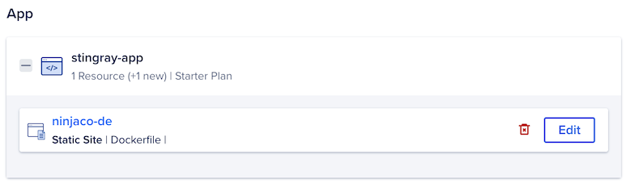

In this post, I will walk through the process of migrating this [Hugo-based](https://gohugo.io) static website (ninjaco.de) from [Dreamhost](https://www.dreamhost.com/) to [Digital Ocean's](https://www.digitalocean.com/) [App Platform](https://www.digitalocean.com/products/app-platform).

While the current hosting is adequate, it's a bit of a process to setup the workflows to automatically publish the _static_ content when I merge in changes. I recently discovered Digital Ocean's App Platform, which allows you to deploy up to three static sites for free.

> Disclaimer: I work at Digital Ocean. Opinions are my own and _totally_ not influenced by my employment.

Hugo is a static site generator. You write your content in Markdown and it's published as HTML. The Digital Ocean App Platform has built-in support for Hugo sites but it's [buildpack](https://docs.digitalocean.com/products/app-platform/reference/buildpacks/hugo/) doesn't currently support [Hugo Modules](https://gohugo.io/categories/hugo-modules/). The alternative is to use a `Dockerfile`, which is the path we'll explore here.


The root of my Hugo site looks like this:

```console
.
├── LICENSE
├── README.md
├── assets
├── config
├── content
├── go.mod
├── go.sum
├── layouts
├── public
├── resources
└── static
```

The buildpack(s) required by an application are automatically detected. The Hugo buildpack, for example, looks for a `config.[json|toml|yaml]` file. That works with some sites and versions of Hugo (as of v0.109.0 the default is now `hugo.[json|toml|yaml]`), and doesn't recognize a [configuration directory](https://gohugo.io/getting-started/configuration/#configuration-directory). It does, however, detect the `go.sum` used by Hugo Modules and assumes that this is a Go project. The build will then fail because there's no Go source code to compile.

The [solution](https://discourse.gohugo.io/t/issues-with-deploying-on-do-app-platform/44872/5) is to add a `Dockerfile` to the root of your Hugo repository:

```docker
FROM peaceiris/hugo:latest-mod

WORKDIR /app
COPY . /app
RUN hugo -d public
```

> This comes from [hugo-extended-docker](https://github.com/peaceiris/hugo-extended-docker), which is a Docker image containing Hugo extended and Hugo modules. It allows us to build the Hugo site inside a container, avoiding the use of the Hugo buildpack.

Once that file is committed to your repository, you're ready to [begin](https://cloud.digitalocean.com/apps/new).


There will be two applications detected: the Dockerfile and the non-existent Go app.


Delete the second app (`ninjaco.de2`). We'll focus our attention on the first app. Edit that and change the Resource Type from Web Service to Static Site. Set the Output Directory to `/app/public`. Click the link to go back

This will change the hosting plan to Starter, which allows for three free applications.



Click next through `Environment`.

On the Info page, I've edited the application page to `ninja-code` so it's more visible in the dashboard.


Click next and review. The Monthly App Cost should be $0.00.

Click `Create Resources`. This will trigger a pull of your repo. The Docker buildpack will run the Dockerfile, which generates your static site, and upload the content from the `public` directory. This may take several minutes. When it's complete, go to the [Apps dashboard](https://cloud.digitalocean.com/apps/) to see your static site's status. Follow the Live App URL and you should see your static site.

Now, when you merge code to `main`, it will automatically trigger a new build and deployment. Within minutes, your static site will be updated.

The last step is to change the DNS for my domain to point at the new hosting.

Go into the App Settings and edit the Domains.

Click "Add Domain" and enter your domain name. This will give you the option to allow Digital Ocean to manage the domain's DNS, or you can manage it manually. I've opted to move the DNS from Dreamhost to Digital Ocean.

Repeat this process to add any subdomains (like www.ninjaco.de).

Once I changed the DNS (and waited patiently for them to propogate), the new site is live and you can read this post.

In conclusion, the migration process was pretty smooth once I discovered the trick to use a Dockerfile. For newer Hugo sites, this gives you a straightforward path to getting up and running with the App Platform.
