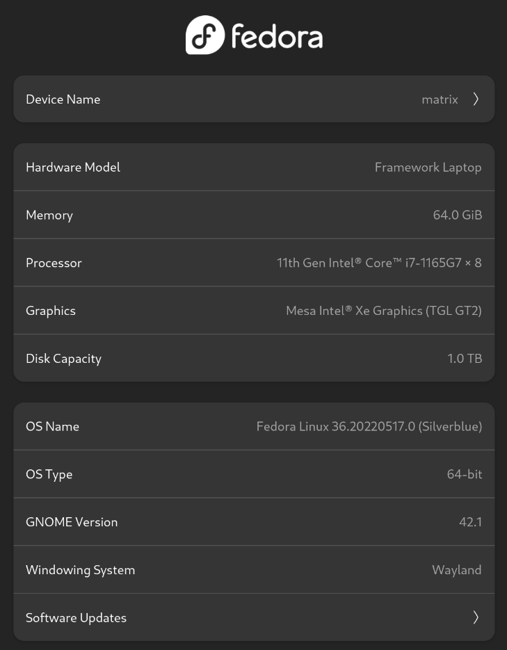
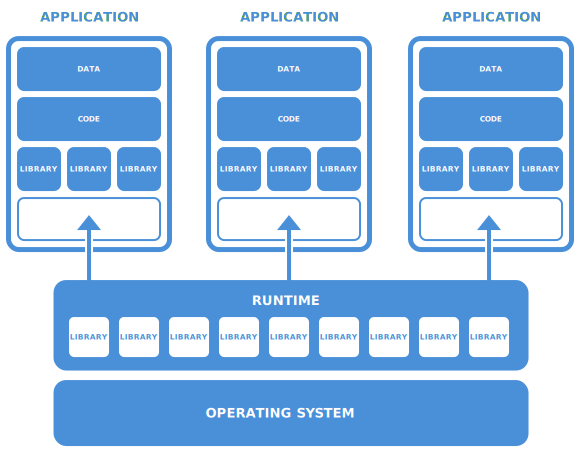
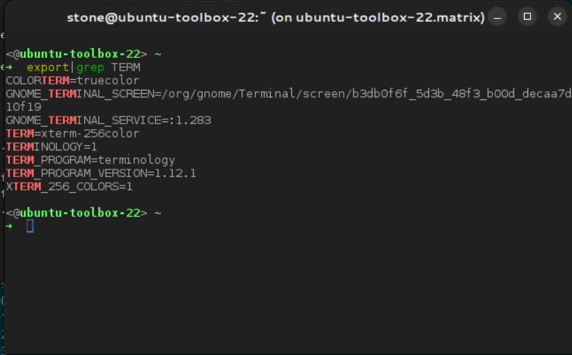
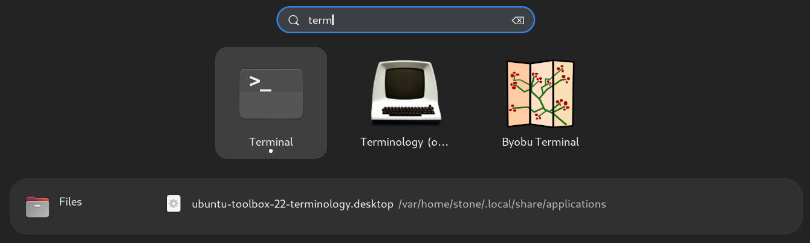

I've been a diehard user of Ubuntu almost since its inception. My home servers, laptops, in the data center, in the cloud, at the edge, it's Ubuntu all the way down. But then someone I trust suggested I try out Fedora Silverblue. I fired up a virtual machine, installed it, and gave it a spin. Before long, I was hooked.

When I started out, we paved servers individually and installed our software, package by package. We scripted the process, before tools like ansible or puppet or terraform were available. Today we have CI/CD and image registries, and tools like docker, podman, and kubernetes. Everything is containerized.

Everything except the desktop.

That's starting to change.

- [Fedora Silverblue](#fedora-silverblue)
- [Immutability](#immutability)
- [GNOME](#gnome)
- [Flatpak](#flatpak)
- [Toolbox, Distrobox and Containers (Oh my!)](#toolbox-distrobox-and-containers-oh-my)
  - [Workspaces](#workspaces)
  - [Applications and Services](#applications-and-services)
- [Overlays](#overlays)
- [uBlue](#ublue)
- [Conclusion](#conclusion)


## Fedora Silverblue

> Fedora Silverblue is an immutable desktop operating system. It aims to be extremely stable and reliable. It also aims to be an excellent platform for developers and  for those using container-focused workflows.

Silverblue is a variant on [Fedora Workstation](https://getfedora.org/en/workstation/). It's an operating system build on layers, using [ostree](https://github.com/ostreedev/ostree), which is a git-like system with transactional updates and rollbacks.


## Immutability

`/var` is where all of Silverblue's runtime state is stored. Everything else is mounted read-only, which prevents accidental damage or tampering. Traditionally writeable paths are symlinked to `/var`, so for example:

- `/home` is a symlink to `/var/home`.
- `/usr/local` is a symlink to `/var/usrlocal`

Running `rpm-ostree update` will do a couple things. It will "checkout" the latest base OS layer and update grub to point to the new image. It will also update the RPMs layed on top of the base layer.

The only downside is that it requires a restart in order to boot into the new base layer. I tend to reboot once a week, to apply updates, unless there's a pressing reason to do so sooner.


## GNOME

On top of an immutable operating system, Silverblue ships with the latest version of GNOME by default (though you can also get [Kinoite](https://fedoramagazine.org/discover-fedora-kinoite/), a Silverblue variant with the KDE Plasma desktop).




## Flatpak

Typically, when I want to install software, I try to install it from the default repositories. If it's not available, I look for a repository that packages it or download the tarball or git clone the repository and install it. No big deal, except that as the months go on your updates get slower, dependencies change, and you run a higher risk of applications -- or your [entire desktop](https://www.gamingonlinux.com/2021/11/system76-patches-apt-for-pop-os-to-prevent-users-breaking-their-systems/) -- breaking. Frankly, the entire process is a hot mess.

It doesn't have to be that way.

[Flatpak](https://flatpak.org/) is a "next-generation technology for building and distributing desktop applications on Linux". In essence, a Flatpak is a containerized application that bundles it's dependencies so that it just works. Run an older application on a new Linux distribution, or a new application on an older Linux distribution.



The applications are packed with their dependencies, and/or rely on other Flatpaks to provide [runtimes](https://docs.flatpak.org/en/latest/basic-concepts.html), such as `GNOME Application Platform version 42`.

The GNOME Software Center is tightly integrated with Flatpak, so use it to easily browse and install your desktop applications. The ecosystem of Flatpaks is growing, and when there isn't a Flatpak available, there are still options.


## Toolbox, Distrobox and Containers (Oh my!)


Today, it's fairly easy to spin up a container on Linux. It's another way to isolate an application or a workspace.

By default, Silverblue ships with [toolbx](https://containertoolbx.org/) but I recommend installing [distrobox](https://github.com/89luca89/distrobox) and using that instead.

> Use any Linux distribution inside your terminal. Enable both backward and forward compatibility with software and freedom to use whatever distribution you’re more comfortable with. Distrobox uses podman or docker to create containers using the Linux distribution of your choice. The created container will be tightly integrated with the host, allowing sharing of the HOME directory of the user, external storage, external USB devices and graphical apps (X11/Wayland), and audio.


To create a container with distrobox, give it an image registry and container name and it'll do the rest:

```
distrobox-create -Y -i public.ecr.aws/ubuntu/ubuntu:22.04 -n ubuntu-toolbox-22
```

To enter the toolbox
```
distrobox-enter -n ubuntu-toolbox-22
<@ubuntu-toolbox-22> ~
➜
```

And from there, I can `apt-get install` anything I like. Ubuntu is running inside Fedora Silverblue, in a container.

Now, there are a few specific ways that I use containers on the desktop:

### Workspaces

I have a container for my day job. When I enter the container, I automatically set up the environment (credentials, paths, etc). I don't need to do anything else to start my work. It's setup to match, as closely as possible, the environment I'll be deploying into -- OS, applications, libraries, etc.

I also keep around a few OS-specific containers; Fedora 36, Ubuntu 22.04. If I need a quick shell, I open one of them up and have all the tools I rely on at my disposal.

### Applications and Services

Installing and using CLI tools in a container is pretty straightforward. What might surprise you is that you can also install and run GUI applications in a container.

Say I want to run [Terminology](https://www.enlightenment.org/about-terminology.md) on my GNOME desktop. I can drop into my Ubuntu container, `apt-get install terminology`. I can run `terminology` from the container:



Here's where distrobox really shines. You can [export](https://github.com/89luca89/distrobox/blob/main/docs/usage/distrobox-export.md) an application, cli, or service from a container to the host OS. In my terminology example, I want to be able to run it without having to open a different terminal and enter a container:

```
<@ubuntu-toolbox-22> ~
➜ distrobox-export --app terminology
Application terminology successfully exported.
OK!
terminology will appear in your applications list in a few seconds.
```

Now I can hit the super key and launch terminology:




You can also export a service from a container:

```
<@ubuntu-toolbox-22> ~
➜ distrobox-export --service syncthing --extra-flags "-allow-newer-config"
```

## Overlays

The last way of installing applications is to overlay them onto the operating system. Installing a package via `rpm-ostree` creates a "package layer" and a new bootable filesystem root. The larger the list of packages you install, the more likely it is that an update will require you to reboot to apply the changes. In general, it's best practice to install applications via Flatpak or container.


There are exceptions to this, though, because `distrobox-enter` can't be run applications that require sudo. So, for example, this doesn't work:

```
sudo tcpdump
Running /usr/bin/distrobox-enter as sudo is not supported.
Please check the documentation on:
	man distrobox-compatibility	or consult the documentation page on:
	https://github.com/89luca89/distrobox/blob/main/docs/compatibility.md
```

In the end, I install from Flatpak first, then container, and lastly overlay.

## uBlue

Last but not least -- the cherry on top -- is uBlue.

See, I've been on Ubuntu for so long that I expect my desktop to work a specific way. The brainchild of Jorge Castro, [uBlue](https://github.com/castrojo/ublue) is a set of scripts that configure Silverblue and GNOME with a different, more familiar set of (opinionated) defaults and shortcuts. If you're coming from Ubuntu, this will make the desktop feel more familiar.


## Conclusion

In the end, we're going to be as opinionated about desktop choice as we are about anything else. You need to find what works for you. Despite my initial skepticism, I've found Silverblue to be a great experience. It's my new default desktop OS. The container-based workflow improved my day to day work habits and productivity, which is always a plus.