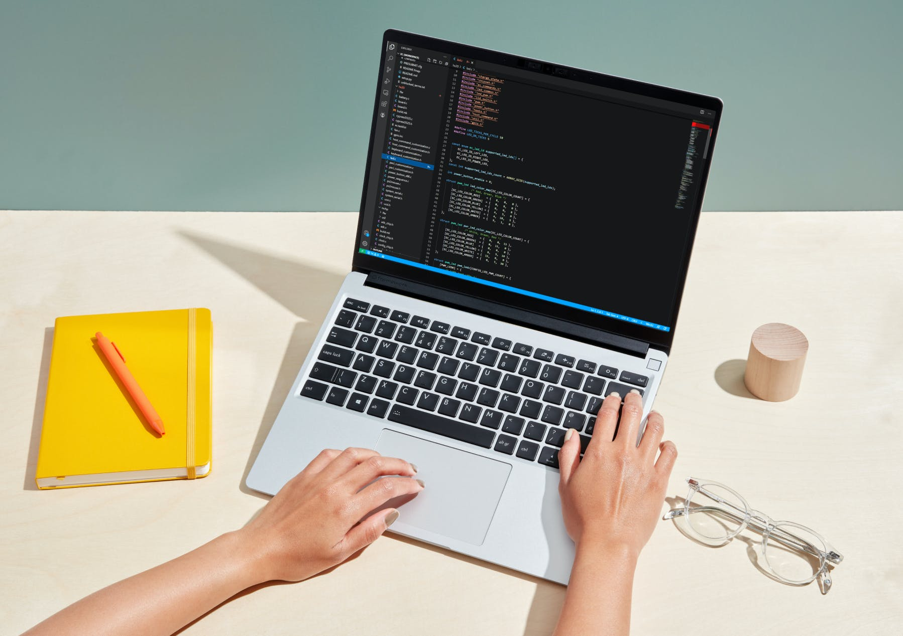
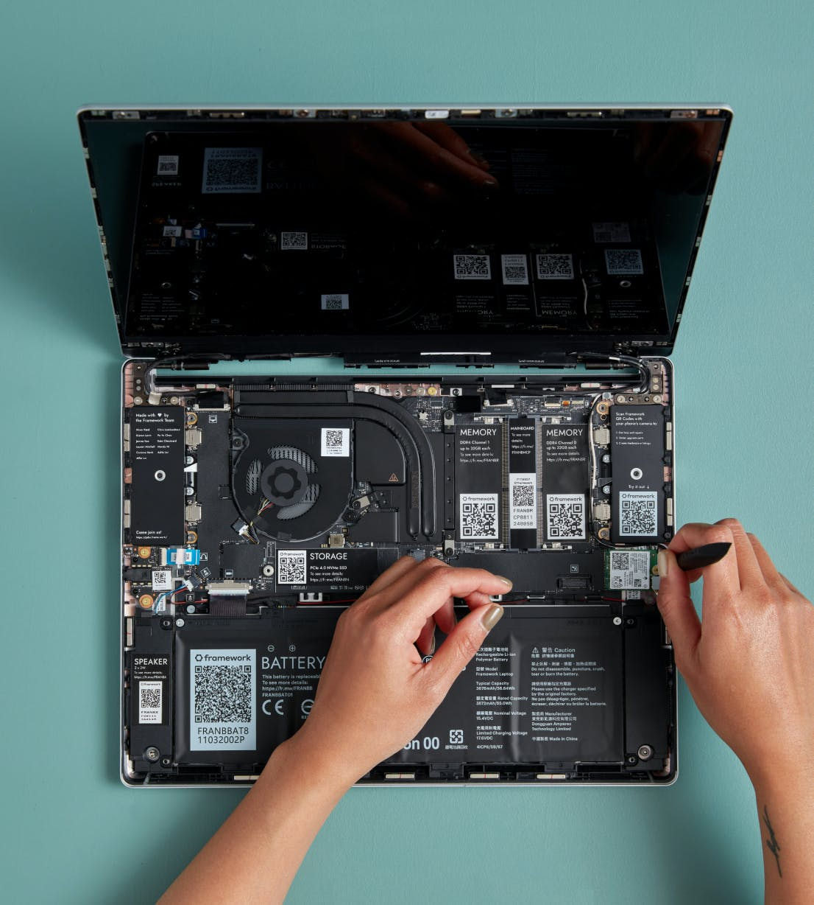

Even though I'm no longer a frequent flyer, I am still primarily a laptop user. Pre-pandemic, I bought a Lenovo Thinkpad X1 Carbon. It's a nice, lightweight machine has served me well until recently; the trackpad isn't as responsive as it once was, and some of the keys are showing their wear. For the price, it wasn't a bad investment to see me through a year and a half.

I've been keeping an eye on a few niche computer manufacturers with an emphasis on Linux: System76 (I already own one of their desktop computers) and Purism, who make security-conscious hardware. A new contender recently entered the playing field, though: Framework.

## Framework

Several months ago, I first read about the Framework laptop. Founded in San Francisco, California (USA) in 2019, Framework's [mission](https://frame.work/ca/en/blog/introducing-the-framework-laptop) is to "empower you with great products you can easily customize, upgrade, and repair, increasing longevity and reducing e-waste in the process."

Their first product is a modular laptop, designed to make it easy to replace or upgrade any component with minimal fuss. The guiding light behind the project is the consumer's [right to repair](https://en.wikipedia.org/wiki/Electronics_right_to_repair); the principle that we have the right to upgrade or repair the electronics that we've purchased.

Most modern-day laptops tend to have their components soldered and glued in, making repairs difficult, time-consuming, and costly. So much so, in fact, that it's often more cost-effective to buy a new laptop than to repair a broken one. I have a stack of used laptops that have gone through that upgrade cycle.

With that in mind, I decided to take a serious look at the Framework laptop.

> A thin, lightweight, high-performance 13.5” notebook that can be upgraded, customized, and repaired in ways that no other notebook can.

The laptop comes with four expansion slots, two on either side of the body. You can buy expansion cards for USB-A, USB-C, HDMI, DisplayPort, MicroSD, and additional storage. Framework has released [reference designs and documentation](https://github.com/FrameworkComputer/ExpansionCards) so that anyone with the tools and know-how can create Expansion Cards. This will help to foster a community of makers to build new cards.

They're even [funding $100,000](https://frame.work/ca/en/blog/expansion-card-developer-program--canada-launch) worth of grants, discounts, and hardware over the next year to encourage Expansion Card developers to get involved.

Inside, all of the components are modular and easily replaced with the included screwdriver, from the mainboard (CPU) and keyboard to the wifi card and magnetically attached bezel on your display. Each component is tagged with a scanable QR code that will link you right to the documentation and repair guide. If something breaks, you can repair or replace it. The plan is to eventually release new mainboards, for example, to upgrade to a new CPU -- including ARM.

## Reviews

At this point, I was sitting on the fence but two things pushed me into action. The first was a review from [Cory Doctorow](https://doctorow.medium.com/the-framework-is-the-most-exciting-laptop-ive-ever-used-5415da0a46e5), after a month with his Framework laptop:

> Based on a month’s use, I am prepared to declare myself a Framework loyalist, and to retire my last Thinkpad…forever.

That's a pretty strong recommendation from someone of Cory's calibre.

A week later, I watched a hands-on review from [Linus Tech Tips](https://www.youtube.com/watch?v=0rkTgPt3M4k), and that sealed the deal.

<iframe width="560" height="315" src="https://www.youtube.com/embed/0rkTgPt3M4k" title="YouTube video player" frameborder="0" allow="accelerometer; autoplay; clipboard-write; encrypted-media; gyroscope; picture-in-picture" allowfullscreen></iframe>

## Risks
<!-- risks -->

With any new product, there's risk involved. Do they have the expertise to deliver on their promise? Will their be enough adoption to sustain the company? Time will tell.

It's still early days, but a little perusing of their founder's [LinkedIn](https://www.linkedin.com/in/nrpframework) page gives me hope; he has history in hardware and software development, ranging from the One Laptop Per Child project to Apple to the Oculus VR headset. That bodes well.

They've just finished shipping their third batch of laptops to consumers. I've read through the [community forum](https://community.frame.work/) and there's an overwhelming sense of joy among these early adopters. Batch four, which I'm a part of, will be shipping this month.

The next milestone for Framework, I think, will be the launch of the forthcoming Marketplace, where replacement parts and Expansion Cards can be purchased. Minimum viable product will be selling their own components, but hopefully we'll see third party hardware on offer before too long. Judging by what I've seen so far, there are already multiple efforts by those in the community to prototype new cards to sell to this eager market.

The worst case, though, is that the company folds within a few years. By that time, though, I'll have gotten my money's worth out of the laptop. It just means buying a replacement instead of piecemeal upgrading.

<!-- concerns -->
## Concerns

There are a few areas of concern that I should note.

### The display

The display is a 3:2 aspect ratio (2256x1504). Most modern day laptops are either 16:9 or 16:10. In theory, the 3:2 display gives more vertical real estate, which may be good for writing code -- my primary use case.

There's some rumbling in the forums that fractional scaling may be required under Linux to get the most out of the display. I'll be running Ubuntu 21.10, out of beta this month, and from what I'm hearing it should handle that just fine.

### BIOS

The BIOS isn't currently open source, which is a big win for two of Framework's competitors in the Linux laptop space: [System 76](https://www.system76.com/) and [Purism](https://puri.sm/).

From the thread [“Free the EC!” and “Coreboot Only”](https://community.frame.work/t/free-the-ec-and-coreboot-only/791/5):

> [...] open source firmware is well aligned to our mission of building products that are better for people and the planet. Our EC firmware is based on chromium-ec, and we will be releasing source. As noted, we’re also exploring coreboot. We’re currently focused on getting the Framework Laptop out into the world in a lower-risk path that uses an off the shelf proprietary BIOS, but we’re looking forward to replacing that with an open alternative in the future.

### Keyboard

From what I can tell, the keyboard is on par with a pre-touchbar Macbook, including the half-sized arrow keys with no physical page-up/down.

That's something I still haven't gotten used to on my own Macbook Pro (used for my non-code writing) but something I'll get used to.

A lot of people who're coming from a Thinkpad have lamented the lack of physical mouse keys or the famous red nipple, but I've rarely found myself using either.

## Pulling the trigger

If the reviews weren't enough to convince me, writing this post and analyzing the details was enough to convince me to give Framework a shot.

The laptop comes in two flavours: fully assembled or DIY, where you're sent the components and you put it together yourself at a savings of $300. Naturally, I've chosen the later.

## The specs

### Configuration

- CPU: Intel® Core™ i7-1165G7
- WiFi: Intel® Wi-Fi 6E AX210 No vPro®
- Memory: 64GB (2 x 32GB) DDR4-3200

### Expansion Cards

- 1x HDMI
- 1x DisplayPort
- 1x USB-A
- 1x MicroSD
- 2x USB-c
- 1x Storage (1TB)

### Accessories

- Framework Screwdriver
- Power Adapter

I may make a few modifications to my order before it ships; I'm thinking of adding a second USB-A card, and dropping the power adapter in favour of one that has additional USB-C ports built-in. I use one port just to charge my phone, so there's no need to use a port on the laptop when I could just use one on the charger.

## Conclusion

The real conclusion will come when I've had some hands-on time with the Framework laptop. Right now, it's a promising idea and I have high hopes that it'll live up to the expectation.

Expect a follow-up post with pictures and details later this fall.