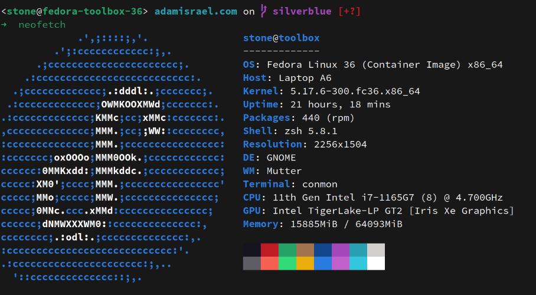

It's been six months since I've had the [Framework laptop](/blog/framework-laptop-preorder/), using it as my daily driver. At this point, I'm comfortable enough with it to talk about the pros and cons, for anyone considering a Framework for their next laptop purchase.

- [OS](#os)
- [Firmware](#firmware)
- [Screen](#screen)
- [Keyboard](#keyboard)
- [Battery life](#battery-life)
- [Trackpad](#trackpad)
- [Performance](#performance)
- [Repairability](#repairability)
- [Parting thoughts](#parting-thoughts)

## OS

I initially started out running Ubuntu 21.10, but soon switched to [Fedora Silverblue](https://docs.fedoraproject.org/en-US/fedora-silverblue/) 35, and then to 36. It's modern enough that all of the Framework's newer hardware is supported out of the box, plus the bonus of it being an immutable Operating System. More on that in another post.

## Firmware

I ran with the stock firmware for several months. I'd been waiting for the updates to be available in fwupdmgr. One day, it got [stuck in a reboot loop](https://community.frame.work/t/stuck-in-a-loop/16163) after resuming from sleep.

The short-term fix was to pull the CMOS battery off the mainboard, but the loop resumed the next time I put the laptop to sleep. And this time, the laptop stopped charging. Neither USB-C port was working.

Another yank of the CMOS battery. At this point, I suspected that the firmware had somehow been corrupt. I ended up downloading the firmware update to a USB stick and flashing via the EFI shell.

Two months later, I haven't had a single issue with sleep/resume or the firmware.

## Screen

I was apprehensive about the screen at first. It's a 3:2 display, rather than the more common 16:9 found in most laptops today, and the screen is glossy. The resolution is 2256x1504, which leaves the text just a little hard to read with my eyes. I've enabled fractional scaling, at 125%, and the display works much better for my tastes.

Compared to my Macbook Pro screen, the Framework is the hands-down winner. The keys don't smudge the screen like the MBP is prone to do. In fact, the screen hardly smudges at all.

## Keyboard

It took a little getting used to having the Control and Function keys in that order, versus the Thinkpad's standard Fn and Ctrl. Other than that, the keyboard is absolutely solid.

## Battery life

Not gonna lie. The battery life is the current weak spot on the Framework. There's some work being done within the community to figure out how to enable deep sleep, which I haven't taken the time to test out.

Right now, the battery drains ~25% overnight when suspended. I'm sure there are improvements I could make -- enabling deep sleep, for example. There's also firmware changes that need to be made to shore up the battery life.

There's lots of room for improvement. Hopefully this is a focal point for future efforts, but with COVID it's not like I'm ever far from a power outlet.

## Trackpad

The trackpad was initally pretty stiff, but a few hard clicks and it's working just fine. I disabled "tap to click" because I kept mis-clicking.

## Performance

Others have already done more formal [benchmarking](https://community.frame.work/t/the-benchmark-thread-cpu-performance/11112). Between the i7 CPU and 64GB of RAM, I've hardly stressed the Framework at all. I've tried pushing it hard, too.

I fired up a VM with Fedora 35 running a Kubernetes workload via kind. The fans spun up a little faster but that was it.

## Repairability

Assembling the Framework took me five minutes, and most of that was fiddling with the wifi antenna leads and getting them snapped into place. The expansion cards work as advertised, and the [Framework Marketplace](https://frame.work/marketplace) has opened, where you can purchase parts to replace any component of the laptop. You can even buy a mainboard and [build yourself](https://frame.work/blog/mainboard-availability-and-open-source-release) a [cyberdeck](https://www.reddit.com/r/cyberDeck/).

## Parting thoughts

Overall, I'm extremely pleased with the Framework laptop. It's well-made and sturdy, is handling all of my daily needs, and is highly repairable should something fail or an upgrade become available.